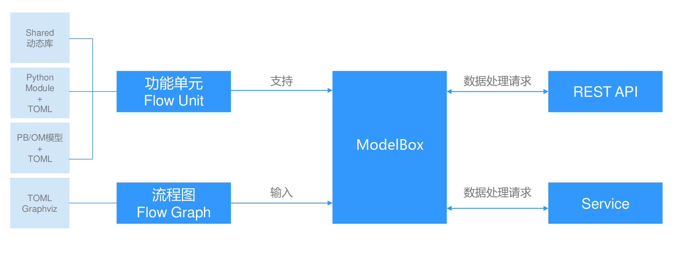

# 基本概念

本节将对ModelBox的基本概念进行介绍，希望在完成阅读后，对开发者ModelBox的整体认识有所帮助。

## ModelBox解决的问题

目前AI应用开发过程时，需要将训练完成模型和应用逻辑串联在一起组成AI应用，并上线发布成为服务。在整个过程中，需要面临复杂的应用编程问题：

* 周边复杂API的使用;
* GPU，NPU等复杂的API;
* 多线程并发互斥;
* 服务化上线复杂;
* 多种开发语言的配合；
* 应用性能，质量不满足要求;

ModelBox的目标就是解决AI开发者在开发AI应用时的编程复杂度，降低AI应用的开发难度，将复杂的数据处理，并发互斥，多设备协同，组件复用，数据通信，交由ModelBox处理。开发者主要聚焦业务逻辑本身，而不是软件细节。
在提高AI推理开发的效率同时，保证软件的性能，可靠性，安全性等属性。

## ModelBox的核心概念

如图所示，开发者在使用ModelBox前，需要关注的基本核心概念包括：功能单元、流程图、和接收数据处理请求的部分（REST API、Service）。

1. 流程图：  
ModelBox中用流程图(Graph)来表达应用逻辑。采用有向图的方式，将应用的执行逻辑表达为顶点和边，其中顶点表示了应用的某个数据处理逻辑单元，边则表示了逻辑单元之间的数据传递关系。在ModelBox中，针对流程图的开发，既可以使用文本方式直接编辑，也可以使用可视化的编辑器进行编辑。对于流程图的表述，ModelBox默认采用Graphviz进行解释，即图的表述需要满足Graphviz的语法要求。

1. 功能单元：  
ModelBox将流程图中的顶点称为功能单元(FlowUnit)。功能单元是应用的基本组成部分，也是ModelBox的执行单元。在ModelBox中，内置了大量的基础功能单元，开发者可以将这些功能单元直接集成到应用流程图中，这也是基于流程图开发的一大好处。除内置功能单元外，ModelBox支持功能单元的自定义开发，支持的功能单元形式多样，如C/C++动态库、Python脚本、模型+Toml配置文件等。

1. 接收数据处理请求：  
应用流程图构建完毕后，需要数据处理请求才能触发应用运行。ModelBox提供两种数据处理请求接收的方式：在flowunit中，通过在加载时调用API产生数据处理的请求，因为产生的请求是固定的，所以一般用于调试场景；标准使用方式是使用ModelBox提供的[服务插件](../develop/service-plugin/service-plugin.md)机制，在插件中接收外部请求，并调用任务相关的API来完成数据处理的请求。ModelBox提供了默认的服务插件可用于参考。数据处理请求的创建请详见[数据流](../framework-conception/stream.md)。

1. ModelBox：  
在应用构建完成后，结合ModelBox的框架才能形成完整可运行的应用。ModelBox作为应用入口，首先进行功能单元的扫描加载、应用流程图读取构建，然后接收数据处理请求，数据触发ModelBox中的执行引擎对功能单元进行调度，最终完成请求的数据处理任务。

1. 更多概念  
更详细的概念可以阅读[基本概念](../framework-conception/framework-conception.md)章节的内容。

## ModelBox的运行模式

ModelBox主要分为如下三部分组件：

* libmodelbox：  
ModelBox的核心部分，负责图加载、功能单元加载、设备加载、图的执行调度等功能，可以通过使用其提供的API单独集成此组件到已有系统中。

* drivers：  
ModelBox的设备插件及预置功能单元插件集合。

* modelbox：  
包含ModelBox的启动、服务插件加载、预置的服务插件。这里的插件就是前文提到的`服务插件`，主要解决应用对接收数据处理请求的定制化实现需求。这部分组件包含了ModelBox的执行入口，启动后，会先加载服务插件，然后服务插件中使用任务接口创建出图，之后再由服务插件接收请求并在图中创建数据处理的请求。同时ModelBox组件中还包含了名为[ModelBox Tool](../develop/modelbox-tool/modelbox-tool.md)的工具，此工具提供了许多调试的能力。

在理解了ModelBox的组成后，再来看一下ModelBox的运行模式：

* 携带服务插件运行：  
一般的启动方式，这种启动方式需要通过命令执行方式，并指定服务的配置文件，ModelBox会通过服务的配置文件，加载指定的服务插件，并通过服务插件与外部系统的交互来完成对ModelBox需要处理的数据请求管理。

* 常驻服务：  
ModelBox可以通过注册系统服务的方式启动，与上一种方式的区别是ModelBox作为服务由系统拉起，其他部分没有区别。

* 不携带服务插件运行：  
调试流程图时，往往不需要加载服务插件，只是希望验证流程图本身的正确性，此时可以借助到调试工具ModelBox Tool来加载指定的流程图，进行启动验证，具体使用可以参见[ModelBox Tool](../develop/modelbox-tool/modelbox-tool.md)章节。当然，此方法也适用于不依赖服务插件进行数据处理请求响应的应用，例如图中存在处理外部请求的功能单元的场景下，就可以直接使用modelbox-tool启动应用。
